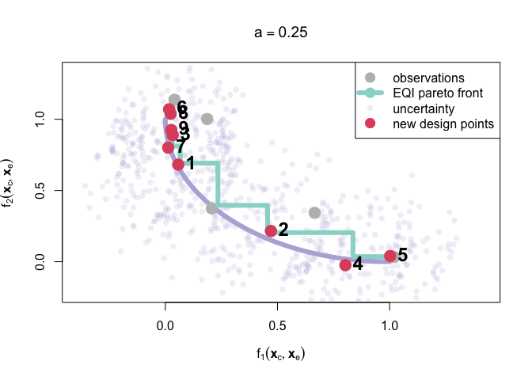
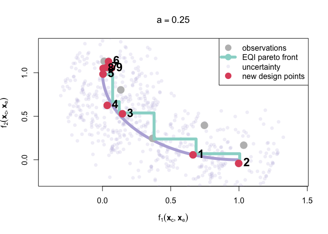

MO-E-EQI
================
2023-12-15

Supplemental materials for (!!!!!!!!!!!!!!! ref !!!!!!!!!!!!!!!!!!)

Authors: D. Semochkina, A.I.J. Forester, D.C. Woods

Corresponding Author: D. Semochkina (<d.semochkina@soton.ac.uk>), School
of Mathematical Sciences, University of Southampton, UK

This repository provides R package to caclulate multi-objective
Euclidian expected quantile improvement (MO-E-EQI) presented in the
manuscript.

First install our package MOEEQI from git. We need the standard package
‘devtools’ to add our package off git.

``` r
install.packages("devtools")
```

This is the standard way to import an R package into the current
session.

``` r
library("devtools")
```

    ## Loading required package: usethis

Now we need to build our package MOEEQI from git.

``` r
install_github("DashaMurasha/MO-E-EQI")
```

    ## Downloading GitHub repo DashaMurasha/MO-E-EQI@HEAD

    ## 
    ## ── R CMD build ─────────────────────────────────────────────────────────────────
    ##      checking for file ‘/private/var/folders/rv/328k5chd2px4l66r9w03g4lm0000gp/T/RtmpP9rux2/remotesa1c1285c165/DashaMurasha-MO-E-EQI-9f0661a/DESCRIPTION’ ...  ✔  checking for file ‘/private/var/folders/rv/328k5chd2px4l66r9w03g4lm0000gp/T/RtmpP9rux2/remotesa1c1285c165/DashaMurasha-MO-E-EQI-9f0661a/DESCRIPTION’
    ##   ─  preparing ‘MOEEQI’:
    ##      checking DESCRIPTION meta-information ...  ✔  checking DESCRIPTION meta-information
    ##      Warning: design_repetitions.Rd:59: unexpected END_OF_INPUT '
    ##    '
    ##      Warning: mean_obs.Rd:71: unexpected END_OF_INPUT '
    ##    '
    ##      Warning: pareto_front.Rd:84: unexpected END_OF_INPUT '
    ##    '
    ##      Warning: tau_eq_sqrd.Rd:63: unexpected END_OF_INPUT '
    ##    '
    ##   ─  checking for LF line-endings in source and make files and shell scripts
    ##   ─  checking for empty or unneeded directories
    ##      Omitted ‘LazyData’ from DESCRIPTION
    ##   ─  building ‘MOEEQI_0.1.0.tar.gz’
    ##      
    ## 

Note that the above instructions should only need running once in order
to install our package. After which we can just run:

``` r
library("MOEEQI")
```

    ## Loading required package: MASS

    ## Loading required package: DiceKriging

    ## Loading required package: prodlim

Next, we move on to the example accompanying the paper (!!!!!!!!!!!!!!!
ref !!!!!!!!!!!!!!!!!!)

We first set the level of noise and define out funstions

``` r
# Set a
a=0.25
# Test functions
f1 <- function(x,theta){
  x1 <- unlist(x[,1])
  x2 <- unlist(x[,2])
  theta1 <- unlist(theta[,1])
  theta2 <- unlist(theta[,2])
  1-sin(x1)+x2/10+a*cos(theta1)+theta2/10
}
f2 <- function(x,theta){
  x1 <- unlist(x[,1])
  x2 <- unlist(x[,2])
  theta1 <- unlist(theta[,1])
  theta2 <- unlist(theta[,2])
  1-cos(x1)+x2/3+a*sin(theta1)+theta2/3
  
}
```

Choose the number of repetitions of each model run

``` r
# Number of repetitions of each observation (model run)
MC_sample_size <- 100
```

Choose the number of steps of the MO-E-EsQI sequential design loop

``` r
# Computational budget (steps in the loop)
Nsteps <- 9
```

Select initial design points.

``` r
# Input parameters ranges
x_c_1_range <- c(0, pi/2)
x_c_2_range <-  c(0, 1)

# Number of original design points
n_sample_points <- 5

# Generate original design (maximin Latin hypercube)
design_X <- MaxPro::MaxProLHD( n = n_sample_points, p = 2, itermax = 20 )
design_X <- MaxPro::MaxPro( InitialDesign = design_X$Design, iteration = 10 )$Design

design_X <- as.matrix(t(t(design_X)*c(diff(x_c_1_range), diff(x_c_2_range))+
                          c(x_c_1_range[1],x_c_2_range[1])))
# Make it a data.frame
orig_design_X <- data.frame(x=design_X)
```

Choose the metric option. Currently two options available, -log(EQI)
(‘NegLogEQI’) or -EQI (‘NegEQI’)

``` r
Option <- 'NegLogEQI'
```

select quantile level (see EQI (!!!!!!!!!!!!!!! ref !!!!!!!!!!!!!!!!!!)
for details)

``` r
beta <- .8
```

Define some objects to store results

``` r
y1_orig <- y2_orig <- epsilons_orig <- NULL
y1_all <- y2_all <- NULL
var1 <- var2 <- NULL
y_plot <- NULL
```

Define the noise level for the second environmental variable

``` r
mu_2 <- 0
sigma_2 <- 0.5
```

Run the model at the original design points

``` r
for (i in 1:n_sample_points) {
  # data_points <- expand.grid(theta=orig_design_X$theta[i],x=rnorm(MC_sample_size,0.4,1))
  data_points <- cbind(x <- matrix(rep(orig_design_X[i,],each=MC_sample_size),MC_sample_size,2),
                       theta.1=runif(MC_sample_size,-pi,pi),
                       theta.2=rnorm(MC_sample_size,mu_2,sigma_2))
  
  y1_orig <- c(y1_orig, mean(f1(data_points[,1:2],data_points[,3:4])))
  y2_orig <- c(y2_orig, mean(f2(data_points[,1:2],data_points[,3:4])))
  y1_all <- rbind(y1_all, unlist(c(f1(data_points[,1:2],data_points[,3:4]), orig_design_X[i,])))
  y2_all <- rbind(y2_all, unlist(c(f2(data_points[,1:2],data_points[,3:4]), orig_design_X[i,])))
  var1 <- c(var1,var(f1(data_points[,1:2],data_points[,3:4])))
  var2 <- c(var2,var(f2(data_points[,1:2],data_points[,3:4])))
}
```

Provide noise sd for both objectives.

``` r
noise_sd <- sqrt(c(mean(var1),mean(var2)))
noise_orig_design_sd <- cbind(apply(y1_all[,1:MC_sample_size],1,sd),
                              apply(y2_all[,1:MC_sample_size],1,sd))
```

Write original design and the starting point of the final design.

``` r
design_X <- orig_design_X
```

Calculate future noise. Note that tau is standard deviation (not
variance).

``` r
tau_new <- tau_new_func(MC_sample_size, noise_sd, 1)
tau_orig_design <- tau_new_func(MC_sample_size, noise_sd, nrow(orig_design_X))
# noise.var is the only way to have a stochastic emulator
noise.var <- list(tau1 = tau_orig_design$tau1^2,
                  tau2 = tau_orig_design$tau2^2)
```

Fit emulators

``` r
model_f1 <- DiceKriging::km(formula=~1, design=orig_design_X, response=y1_orig, covtype="gauss", noise.var=noise.var$tau1)
```

    ## 
    ## optimisation start
    ## ------------------
    ## * estimation method   : MLE 
    ## * optimisation method : BFGS 
    ## * analytical gradient : used
    ## * trend model : ~1
    ## * covariance model : 
    ##   - type :  gauss 
    ##   - noise variances :
    ## [1] 0.0003400424 0.0003400424 0.0003400424 0.0003400424 0.0003400424
    ##   - parameters lower bounds :  1e-10 1e-10 
    ##   - parameters upper bounds :  3.141593 2 
    ##   - variance bounds :  0.01788044 2.937852 
    ##   - best initial criterion value(s) :  -0.09719381 
    ## 
    ## N = 3, M = 5 machine precision = 2.22045e-16
    ## At X0, 0 variables are exactly at the bounds
    ## At iterate     0  f=     0.097194  |proj g|=        1.425
    ## At iterate     1  f =    -0.034226  |proj g|=       0.22816
    ## At iterate     2  f =    -0.061834  |proj g|=       0.17694
    ## At iterate     3  f =    -0.081443  |proj g|=       0.86006
    ## At iterate     4  f =    -0.095879  |proj g|=       0.27386
    ## At iterate     5  f =    -0.099194  |proj g|=      0.046829
    ## At iterate     6  f =    -0.099347  |proj g|=     0.0081983
    ## At iterate     7  f =    -0.099349  |proj g|=     0.0023538
    ## At iterate     8  f =    -0.099349  |proj g|=    0.00048699
    ## At iterate     9  f =    -0.099349  |proj g|=    1.7561e-05
    ## At iterate    10  f =    -0.099349  |proj g|=    1.1877e-07
    ## 
    ## iterations 10
    ## function evaluations 13
    ## segments explored during Cauchy searches 12
    ## BFGS updates skipped 0
    ## active bounds at final generalized Cauchy point 1
    ## norm of the final projected gradient 1.18773e-07
    ## final function value -0.0993486
    ## 
    ## F = -0.0993486
    ## final  value -0.099349 
    ## converged

``` r
model_f2 <- DiceKriging::km(formula=~1, design=orig_design_X, response=y2_orig, covtype="gauss", noise.var=noise.var$tau2)
```

    ## 
    ## optimisation start
    ## ------------------
    ## * estimation method   : MLE 
    ## * optimisation method : BFGS 
    ## * analytical gradient : used
    ## * trend model : ~1
    ## * covariance model : 
    ##   - type :  gauss 
    ##   - noise variances :
    ## [1] 0.0006312351 0.0006312351 0.0006312351 0.0006312351 0.0006312351
    ##   - parameters lower bounds :  1e-10 1e-10 
    ##   - parameters upper bounds :  3.141593 2 
    ##   - variance bounds :  0.01552255 2.099604 
    ##   - best initial criterion value(s) :  -1.375825 
    ## 
    ## N = 3, M = 5 machine precision = 2.22045e-16
    ## At X0, 0 variables are exactly at the bounds
    ## At iterate     0  f=       1.3758  |proj g|=       1.8298
    ## At iterate     1  f =       1.3185  |proj g|=        1.7377
    ## At iterate     2  f =       1.2013  |proj g|=        1.1691
    ## At iterate     3  f =       1.1339  |proj g|=        1.1957
    ## At iterate     4  f =       1.1207  |proj g|=       0.15606
    ## At iterate     5  f =       1.1195  |proj g|=       0.16959
    ## At iterate     6  f =        1.114  |proj g|=       0.18168
    ## At iterate     7  f =       1.0924  |proj g|=       0.29827
    ## At iterate     8  f =       1.0725  |proj g|=        0.3833
    ## At iterate     9  f =       1.0541  |proj g|=       0.26274
    ## At iterate    10  f =       1.0525  |proj g|=       0.15929
    ## At iterate    11  f =       1.0504  |proj g|=       0.04657
    ## At iterate    12  f =       1.0502  |proj g|=     0.0013771
    ## At iterate    13  f =       1.0502  |proj g|=    1.8022e-05
    ## At iterate    14  f =       1.0502  |proj g|=    2.6012e-07
    ## 
    ## iterations 14
    ## function evaluations 18
    ## segments explored during Cauchy searches 14
    ## BFGS updates skipped 0
    ## active bounds at final generalized Cauchy point 1
    ## norm of the final projected gradient 2.60122e-07
    ## final function value 1.05018
    ## 
    ## F = 1.05018
    ## final  value 1.050183 
    ## converged

y1_new and y2_new will record new observations, prompted by EQI

``` r
y1_new <- y1_orig
y2_new <- y2_orig
y_plot <- cbind(y1=as.vector(y1_new),y2=as.vector(y2_new), x.1=orig_design_X[,1], x.2=orig_design_X[,2])
```

Now we move to the EQI loop to sequentially add desing points to alter
the Pareto front.

First, we select new points to calculate EQI at. Covers all the points
in the ranges.

``` r
newdata <- expand.grid(x.1 = seq(from=x_c_1_range[1], to=x_c_1_range[2], length.out = 100),
                       x.2 = seq(from=x_c_2_range[1], to=x_c_2_range[2], length.out = 100))
n_sample <- length(newdata[,1])
```

The next line checks which of the current design points exists in the
newdata. This is nessessary for tau_new function

``` r
des_rep <- design_repetitions(newdata, design_X)
```

The next line calculates the default tau_new if there were no
repetitions.

``` r
tau_new <- tau_new_func(MC_sample_size, noise_sd, n_sample)
```

Update the design locations that were repeated

``` r
if(sum(des_rep)!=0){
  tau_new[des_rep[,2],] <- cbind(tau1=sqrt(tau_eq_sqrd(noise.var$tau1[des_rep[,1]],noise.var$tau1[des_rep[,1]])),
                                 tau2=sqrt(tau_eq_sqrd(noise.var$tau2[des_rep[,1]],noise.var$tau2[des_rep[,1]])))
}
```

Add constraint info for objectives (currently set to no constraints).

``` r
ConstraintInfo <- NULL
# ConstraintInfo$ConstraintLimits<-matrix(c(2, 2),1,2)
# #Current observations to be compared against ConstraintLimits
# ConstraintInfo$y <- cbind(y1_new, y2_new)
```

Start the EQI loop

``` r
reps <- NULL
for (i in 1:Nsteps) {
  #calculate EQI metric. Note that other outputs are Pareto front, design and quantile sd
  EQI_newdata <- mult_EQI(newdata,design_X, model_f1, model_f2, beta, tau_new)
  
  #stopping criterion
  # If all expected improvements are 0 -- stop (i.e. -log(0)=Inf)
  if (sum(EQI_newdata$metric==Inf, na.rm = T)==n_sample) break
  # If all expected improvements are the same - select point at random
  else if (length(unique(EQI_newdata$metric)) == 1) {
    # Select a point to add to design
    select_point <- sample(1:n_sample,1)
    # Add selected point to design
    design_X <- rbind(newdata[select_point,],design_X)
  }
  # If not all EQI are zero and not all the same -- standard case
  else{#find the design point with the highest EQI metric (min(-log(EQI)))
    best_X <- which.min(EQI_newdata$metric)
    #find the values of the best design points
    impr_x <- newdata[best_X,]
    repetition <- row.match(impr_x, design_X)
    # Update the design_X
    design_X <- rbind(impr_x,design_X)
  }
  
  
  # Run the model at the new design point (MC over x)
  data_points <-cbind(x <- matrix(rep(design_X[1,],each=MC_sample_size),MC_sample_size,2),
                      theta.1=runif(MC_sample_size,-pi,pi),
                      theta.2=rnorm(MC_sample_size,mu_2,sigma_2))
  
  
  
  if (is.na(repetition)) {
    # Update observations
    y1_new <- c(mean(f1(data_points[,1:2],data_points[,3:4])), y1_new)
    y2_new <- c(mean(f2(data_points[,1:2],data_points[,3:4])), y2_new)
    y1_all <- rbind(unlist(c(f1(data_points[,1:2],data_points[,3:4]), design_X[1,])),y1_all)
    y2_all <- rbind(unlist(c(f2(data_points[,1:2],data_points[,3:4]), design_X[1,])),y2_all)
    # Update the tunable future noise
    tau_at_best_X <-  tau_new_func(MC_sample_size, c(sd(y1_all[1,1:MC_sample_size]),sd(y2_all[1,1:MC_sample_size])), 1)
    tau_new[best_X,] <- cbind(tau1=sqrt(tau_eq_sqrd(tau_at_best_X$tau1^2,tau_at_best_X$tau1^2)),
                              tau2=sqrt(tau_eq_sqrd(tau_at_best_X$tau2^2,tau_at_best_X$tau2^2)))
    # Update the observations noise
    noise.var <- data.frame(tau1 = c(tau_at_best_X$tau1^2,noise.var$tau1),
                            tau2 = c(tau_at_best_X$tau2^2,noise.var$tau2))
    y_plot <- rbind(c(y1=mean(f1(data_points[,1:2],data_points[,3:4])), y2=mean(f2(data_points[,1:2],data_points[,3:4])),
                      x.1=design_X[1,1], x.2=design_X[1,2]), y_plot)
  }else{
    # Update observations
    y1_all <- rbind(unlist(c(f1(data_points[,1:2],data_points[,3:4]), design_X[1,])),y1_all)
    y2_all <- rbind(unlist(c(f2(data_points[,1:2],data_points[,3:4]), design_X[1,])),y2_all)
    y_plot <- rbind(c(y1=mean(f1(data_points[,1:2],data_points[,3:4])), y2=mean(f2(data_points[,1:2],data_points[,3:4])),
                      x.1=design_X[1,1], x.2=design_X[1,2]), y_plot)
    design_X <- design_X[-1,]
    y1_new[repetition] <- mean_obs(mean(f1(data_points[,1:2],data_points[,3:4])),y1_new[repetition],noise_sd[1]^2/MC_sample_size,noise.var$tau1[repetition])
    y2_new[repetition] <- mean_obs(mean(f2(data_points[,1:2],data_points[,3:4])),y2_new[repetition],noise_sd[2]^2/MC_sample_size,noise.var$tau2[repetition])
    
    # Update the tunable future noise
    tau_at_best_X <- tau_new_func(MC_sample_size, c(sd(y1_all[1,1:MC_sample_size]),sd(y2_all[1,1:MC_sample_size])), 1)
    tau_new[best_X,] <- cbind(tau1=sqrt(tau_eq_sqrd((tau_new[best_X,]$tau1)^2,tau_at_best_X$tau1^2)),
                              tau2=sqrt(tau_eq_sqrd((tau_new[best_X,]$tau2)^2,tau_at_best_X$tau2^2)))
    # Update the observations noise
    noise.var$tau1[repetition] <- tau_eq_sqrd(noise.var$tau1[repetition], tau_at_best_X$tau1^2)
    noise.var$tau2[repetition] <- tau_eq_sqrd(noise.var$tau2[repetition], tau_at_best_X$tau2^2)
    
    reps <- c(reps, repetition)
  }
  model_f1 <- km(formula=~1, design=design_X, response=y1_new, covtype="gauss", noise.var=noise.var$tau1)
  model_f2 <- km(formula=~1, design=design_X, response=y2_new, covtype="gauss", noise.var=noise.var$tau2)
}
```

    ## 
    ## optimisation start
    ## ------------------
    ## * estimation method   : MLE 
    ## * optimisation method : BFGS 
    ## * analytical gradient : used
    ## * trend model : ~1
    ## * covariance model : 
    ##   - type :  gauss 
    ##   - noise variances :
    ## [1] 0.0003851625 0.0003400424 0.0003400424 0.0003400424 0.0003400424
    ## [6] 0.0003400424
    ##   - parameters lower bounds :  1e-10 1e-10 
    ##   - parameters upper bounds :  3.141593 2 
    ##   - variance bounds :  0.01694186 3.120801 
    ##   - best initial criterion value(s) :  1.97659 
    ## 
    ## N = 3, M = 5 machine precision = 2.22045e-16
    ## At X0, 0 variables are exactly at the bounds
    ## At iterate     0  f=      -1.9766  |proj g|=       1.2401
    ## At iterate     1  f =      -2.0838  |proj g|=        0.7853
    ## At iterate     2  f =      -2.2364  |proj g|=       0.23469
    ## At iterate     3  f =      -2.2699  |proj g|=       0.48174
    ## At iterate     4  f =      -2.3162  |proj g|=        0.5857
    ## At iterate     5  f =      -2.3275  |proj g|=       0.18913
    ## At iterate     6  f =      -2.3297  |proj g|=      0.016775
    ## At iterate     7  f =      -2.3297  |proj g|=     0.0018578
    ## At iterate     8  f =      -2.3297  |proj g|=    2.2479e-05
    ## At iterate     9  f =      -2.3297  |proj g|=    1.5752e-07
    ## 
    ## iterations 9
    ## function evaluations 13
    ## segments explored during Cauchy searches 11
    ## BFGS updates skipped 0
    ## active bounds at final generalized Cauchy point 1
    ## norm of the final projected gradient 1.57524e-07
    ## final function value -2.32974
    ## 
    ## F = -2.32974
    ## final  value -2.329736 
    ## converged
    ## 
    ## optimisation start
    ## ------------------
    ## * estimation method   : MLE 
    ## * optimisation method : BFGS 
    ## * analytical gradient : used
    ## * trend model : ~1
    ## * covariance model : 
    ##   - type :  gauss 
    ##   - noise variances :
    ## [1] 0.0005503511 0.0006312351 0.0006312351 0.0006312351 0.0006312351
    ## [6] 0.0006312351
    ##   - parameters lower bounds :  1e-10 1e-10 
    ##   - parameters upper bounds :  3.141593 2 
    ##   - variance bounds :  0.01379296 2.078901 
    ##   - best initial criterion value(s) :  -0.8520622 
    ## 
    ## N = 3, M = 5 machine precision = 2.22045e-16
    ## At X0, 0 variables are exactly at the bounds
    ## At iterate     0  f=      0.85206  |proj g|=       2.8703
    ## At iterate     1  f =     -0.15434  |proj g|=        1.9633
    ## At iterate     2  f =     -0.44046  |proj g|=        1.9354
    ## At iterate     3  f =     -0.62513  |proj g|=       0.71153
    ## At iterate     4  f =     -0.65563  |proj g|=       0.83147
    ## At iterate     5  f =     -0.76551  |proj g|=       0.77093
    ## At iterate     6  f =      -0.9478  |proj g|=        0.8459
    ## At iterate     7  f =      -1.0394  |proj g|=       0.87158
    ## At iterate     8  f =      -1.0778  |proj g|=        0.6471
    ## At iterate     9  f =       -1.091  |proj g|=      0.085607
    ## At iterate    10  f =      -1.0916  |proj g|=      0.020305
    ## At iterate    11  f =      -1.0917  |proj g|=      0.003124
    ## At iterate    12  f =      -1.0917  |proj g|=    4.4673e-05
    ## At iterate    13  f =      -1.0917  |proj g|=    3.3192e-06
    ## 
    ## iterations 13
    ## function evaluations 17
    ## segments explored during Cauchy searches 15
    ## BFGS updates skipped 0
    ## active bounds at final generalized Cauchy point 1
    ## norm of the final projected gradient 3.31916e-06
    ## final function value -1.09173
    ## 
    ## F = -1.09173
    ## final  value -1.091732 
    ## converged
    ## 
    ## optimisation start
    ## ------------------
    ## * estimation method   : MLE 
    ## * optimisation method : BFGS 
    ## * analytical gradient : used
    ## * trend model : ~1
    ## * covariance model : 
    ##   - type :  gauss 
    ##   - noise variances :
    ## [1] 0.0003332050 0.0003851625 0.0003400424 0.0003400424 0.0003400424
    ## [6] 0.0003400424 0.0003400424
    ##   - parameters lower bounds :  1e-10 1e-10 
    ##   - parameters upper bounds :  3.141593 2 
    ##   - variance bounds :  0.0194748 3.364874 
    ##   - best initial criterion value(s) :  3.268775 
    ## 
    ## N = 3, M = 5 machine precision = 2.22045e-16
    ## At X0, 0 variables are exactly at the bounds
    ## At iterate     0  f=      -3.2688  |proj g|=       2.4206
    ## At iterate     1  f =      -3.6336  |proj g|=        3.2302
    ## At iterate     2  f =      -3.7131  |proj g|=        3.1784
    ## At iterate     3  f =      -3.8891  |proj g|=       0.40399
    ## At iterate     4  f =      -3.9049  |proj g|=       0.21467
    ## At iterate     5  f =      -4.0012  |proj g|=       0.56698
    ## At iterate     6  f =      -4.0086  |proj g|=       0.30859
    ## At iterate     7  f =      -4.0122  |proj g|=     0.0022113
    ## At iterate     8  f =      -4.0122  |proj g|=    0.00019171
    ## At iterate     9  f =      -4.0122  |proj g|=     1.901e-07
    ## 
    ## iterations 9
    ## function evaluations 12
    ## segments explored during Cauchy searches 11
    ## BFGS updates skipped 0
    ## active bounds at final generalized Cauchy point 1
    ## norm of the final projected gradient 1.90099e-07
    ## final function value -4.01221
    ## 
    ## F = -4.01221
    ## final  value -4.012212 
    ## converged
    ## 
    ## optimisation start
    ## ------------------
    ## * estimation method   : MLE 
    ## * optimisation method : BFGS 
    ## * analytical gradient : used
    ## * trend model : ~1
    ## * covariance model : 
    ##   - type :  gauss 
    ##   - noise variances :
    ## [1] 0.0005621549 0.0005503511 0.0006312351 0.0006312351 0.0006312351
    ## [6] 0.0006312351 0.0006312351
    ##   - parameters lower bounds :  1e-10 1e-10 
    ##   - parameters upper bounds :  3.141593 2 
    ##   - variance bounds :  0.01629245 2.700095 
    ##   - best initial criterion value(s) :  0.2360067 
    ## 
    ## N = 3, M = 5 machine precision = 2.22045e-16
    ## At X0, 0 variables are exactly at the bounds
    ## At iterate     0  f=     -0.23601  |proj g|=       2.5474
    ## At iterate     1  f =     -0.93736  |proj g|=        2.4753
    ## At iterate     2  f =      -1.0952  |proj g|=       0.44679
    ## At iterate     3  f =      -1.1549  |proj g|=       0.42871
    ## At iterate     4  f =      -1.2742  |proj g|=        0.5457
    ## At iterate     5  f =      -1.3743  |proj g|=       0.76537
    ## At iterate     6  f =      -1.4154  |proj g|=       0.60081
    ## At iterate     7  f =      -1.4416  |proj g|=       0.16446
    ## At iterate     8  f =      -1.4432  |proj g|=      0.051925
    ## At iterate     9  f =      -1.4436  |proj g|=      0.011819
    ## At iterate    10  f =      -1.4436  |proj g|=     0.0050264
    ## At iterate    11  f =      -1.4436  |proj g|=    0.00028141
    ## At iterate    12  f =      -1.4436  |proj g|=     1.937e-05
    ## At iterate    13  f =      -1.4436  |proj g|=    5.3091e-07
    ## 
    ## iterations 13
    ## function evaluations 16
    ## segments explored during Cauchy searches 15
    ## BFGS updates skipped 0
    ## active bounds at final generalized Cauchy point 1
    ## norm of the final projected gradient 5.30906e-07
    ## final function value -1.44365
    ## 
    ## F = -1.44365
    ## final  value -1.443645 
    ## converged
    ## 
    ## optimisation start
    ## ------------------
    ## * estimation method   : MLE 
    ## * optimisation method : BFGS 
    ## * analytical gradient : used
    ## * trend model : ~1
    ## * covariance model : 
    ##   - type :  gauss 
    ##   - noise variances :
    ## [1] 0.0003573473 0.0003332050 0.0003851625 0.0003400424 0.0003400424
    ## [6] 0.0003400424 0.0003400424 0.0003400424
    ##   - parameters lower bounds :  1e-10 1e-10 
    ##   - parameters upper bounds :  3.141593 2 
    ##   - variance bounds :  0.01820033 3.072403 
    ##   - best initial criterion value(s) :  5.504052 
    ## 
    ## N = 3, M = 5 machine precision = 2.22045e-16
    ## At X0, 0 variables are exactly at the bounds
    ## At iterate     0  f=      -5.5041  |proj g|=         2.16
    ## At iterate     1  f =       -5.901  |proj g|=       0.40144
    ## At iterate     2  f =      -6.1748  |proj g|=        1.0634
    ## At iterate     3  f =      -6.2474  |proj g|=        1.2211
    ## At iterate     4  f =      -6.3145  |proj g|=       0.59064
    ## At iterate     5  f =      -6.3821  |proj g|=       0.75491
    ## At iterate     6  f =      -6.4334  |proj g|=       0.35128
    ## At iterate     7  f =      -6.4383  |proj g|=      0.083535
    ## At iterate     8  f =      -6.4384  |proj g|=     0.0029845
    ## At iterate     9  f =      -6.4384  |proj g|=    2.5496e-05
    ## At iterate    10  f =      -6.4384  |proj g|=    9.6491e-08
    ## 
    ## iterations 10
    ## function evaluations 14
    ## segments explored during Cauchy searches 13
    ## BFGS updates skipped 0
    ## active bounds at final generalized Cauchy point 1
    ## norm of the final projected gradient 9.64907e-08
    ## final function value -6.43837
    ## 
    ## F = -6.43837
    ## final  value -6.438370 
    ## converged
    ## 
    ## optimisation start
    ## ------------------
    ## * estimation method   : MLE 
    ## * optimisation method : BFGS 
    ## * analytical gradient : used
    ## * trend model : ~1
    ## * covariance model : 
    ##   - type :  gauss 
    ##   - noise variances :
    ## [1] 0.0007849974 0.0005621549 0.0005503511 0.0006312351 0.0006312351
    ## [6] 0.0006312351 0.0006312351 0.0006312351
    ##   - parameters lower bounds :  1e-10 1e-10 
    ##   - parameters upper bounds :  3.141593 2 
    ##   - variance bounds :  0.0177139 2.990653 
    ##   - best initial criterion value(s) :  2.077679 
    ## 
    ## N = 3, M = 5 machine precision = 2.22045e-16
    ## At X0, 0 variables are exactly at the bounds
    ## At iterate     0  f=      -2.0777  |proj g|=       2.6778
    ## At iterate     1  f =      -2.2775  |proj g|=         1.642
    ## At iterate     2  f =      -2.5816  |proj g|=        0.9874
    ## At iterate     3  f =      -2.8207  |proj g|=        0.4413
    ## At iterate     4  f =      -2.8758  |proj g|=       0.48707
    ## At iterate     5  f =      -2.9429  |proj g|=       0.47231
    ## At iterate     6  f =      -3.0176  |proj g|=        0.1754
    ## At iterate     7  f =      -3.0275  |proj g|=       0.08212
    ## At iterate     8  f =        -3.03  |proj g|=      0.019405
    ## At iterate     9  f =      -3.0301  |proj g|=     0.0034249
    ## At iterate    10  f =      -3.0301  |proj g|=     0.0003087
    ## At iterate    11  f =      -3.0301  |proj g|=    1.6978e-07
    ## At iterate    12  f =      -3.0301  |proj g|=    1.6978e-07
    ## 
    ## iterations 12
    ## function evaluations 28
    ## segments explored during Cauchy searches 14
    ## BFGS updates skipped 0
    ## active bounds at final generalized Cauchy point 1
    ## norm of the final projected gradient 1.69782e-07
    ## final function value -3.03009
    ## 
    ## F = -3.03009
    ## Warning:  more than 10 function and gradient evaluations
    ##    in the last line search
    ## final  value -3.030085 
    ## converged
    ## 
    ## optimisation start
    ## ------------------
    ## * estimation method   : MLE 
    ## * optimisation method : BFGS 
    ## * analytical gradient : used
    ## * trend model : ~1
    ## * covariance model : 
    ##   - type :  gauss 
    ##   - noise variances :
    ## [1] 0.0003642896 0.0003573473 0.0003332050 0.0003851625 0.0003400424
    ## [6] 0.0003400424 0.0003400424 0.0003400424 0.0003400424
    ##   - parameters lower bounds :  1e-10 1e-10 
    ##   - parameters upper bounds :  3.141593 2 
    ##   - variance bounds :  0.01594687 2.711786 
    ##   - best initial criterion value(s) :  7.973315 
    ## 
    ## N = 3, M = 5 machine precision = 2.22045e-16
    ## At X0, 0 variables are exactly at the bounds
    ## At iterate     0  f=      -7.9733  |proj g|=      0.72847
    ## At iterate     1  f =       -8.258  |proj g|=        2.5956
    ## At iterate     2  f =      -8.4512  |proj g|=        2.2515
    ## At iterate     3  f =      -8.6639  |proj g|=        2.1956
    ## At iterate     4  f =      -8.9074  |proj g|=        1.6151
    ## At iterate     5  f =      -9.0242  |proj g|=        1.0432
    ## At iterate     6  f =      -9.0288  |proj g|=       0.58877
    ## At iterate     7  f =      -9.0312  |proj g|=      0.073557
    ## At iterate     8  f =      -9.0313  |proj g|=     0.0065123
    ## At iterate     9  f =      -9.0313  |proj g|=     0.0001085
    ## At iterate    10  f =      -9.0313  |proj g|=    2.0207e-06
    ## 
    ## iterations 10
    ## function evaluations 13
    ## segments explored during Cauchy searches 12
    ## BFGS updates skipped 0
    ## active bounds at final generalized Cauchy point 1
    ## norm of the final projected gradient 2.02071e-06
    ## final function value -9.03127
    ## 
    ## F = -9.03127
    ## final  value -9.031269 
    ## converged
    ## 
    ## optimisation start
    ## ------------------
    ## * estimation method   : MLE 
    ## * optimisation method : BFGS 
    ## * analytical gradient : used
    ## * trend model : ~1
    ## * covariance model : 
    ##   - type :  gauss 
    ##   - noise variances :
    ## [1] 0.0005334182 0.0007849974 0.0005621549 0.0005503511 0.0006312351
    ## [6] 0.0006312351 0.0006312351 0.0006312351 0.0006312351
    ##   - parameters lower bounds :  1e-10 1e-10 
    ##   - parameters upper bounds :  3.141593 2 
    ##   - variance bounds :  0.01650504 2.719201 
    ##   - best initial criterion value(s) :  3.796359 
    ## 
    ## N = 3, M = 5 machine precision = 2.22045e-16
    ## At X0, 0 variables are exactly at the bounds
    ## At iterate     0  f=      -3.7964  |proj g|=       2.3669
    ## At iterate     1  f =      -4.4615  |proj g|=        2.4993
    ## At iterate     2  f =      -4.9134  |proj g|=        2.3984
    ## At iterate     3  f =        -5.03  |proj g|=        1.4549
    ## At iterate     4  f =      -5.1765  |proj g|=       0.69844
    ## At iterate     5  f =      -5.3236  |proj g|=       0.39229
    ## At iterate     6  f =      -5.3987  |proj g|=      0.088816
    ## At iterate     7  f =      -5.3994  |proj g|=      0.085241
    ## At iterate     8  f =       -5.401  |proj g|=      0.003824
    ## At iterate     9  f =       -5.401  |proj g|=    0.00054755
    ## At iterate    10  f =       -5.401  |proj g|=     5.072e-05
    ## At iterate    11  f =       -5.401  |proj g|=    2.2562e-06
    ## 
    ## iterations 11
    ## function evaluations 14
    ## segments explored during Cauchy searches 13
    ## BFGS updates skipped 0
    ## active bounds at final generalized Cauchy point 1
    ## norm of the final projected gradient 2.25617e-06
    ## final function value -5.40099
    ## 
    ## F = -5.40099
    ## final  value -5.400993 
    ## converged
    ## 
    ## optimisation start
    ## ------------------
    ## * estimation method   : MLE 
    ## * optimisation method : BFGS 
    ## * analytical gradient : used
    ## * trend model : ~1
    ## * covariance model : 
    ##   - type :  gauss 
    ##   - noise variances :
    ##  [1] 0.0003341577 0.0003642896 0.0003573473 0.0003332050 0.0003851625
    ##  [6] 0.0003400424 0.0003400424 0.0003400424 0.0003400424 0.0003400424
    ##   - parameters lower bounds :  1e-10 1e-10 
    ##   - parameters upper bounds :  3.141593 2 
    ##   - variance bounds :  0.01664113 2.906503 
    ##   - best initial criterion value(s) :  10.95471 
    ## 
    ## N = 3, M = 5 machine precision = 2.22045e-16
    ## At X0, 0 variables are exactly at the bounds
    ## At iterate     0  f=      -10.955  |proj g|=       2.7638
    ## At iterate     1  f =      -11.078  |proj g|=         1.321
    ## At iterate     2  f =      -11.157  |proj g|=       0.60463
    ## At iterate     3  f =      -11.328  |proj g|=        1.3074
    ## At iterate     4  f =      -11.385  |proj g|=       0.81351
    ## At iterate     5  f =        -11.4  |proj g|=       0.14908
    ## At iterate     6  f =        -11.4  |proj g|=       0.17836
    ## At iterate     7  f =      -11.401  |proj g|=      0.036141
    ## At iterate     8  f =      -11.401  |proj g|=     0.0012288
    ## At iterate     9  f =      -11.401  |proj g|=    0.00013399
    ## At iterate    10  f =      -11.401  |proj g|=    8.2764e-08
    ## 
    ## iterations 10
    ## function evaluations 15
    ## segments explored during Cauchy searches 12
    ## BFGS updates skipped 0
    ## active bounds at final generalized Cauchy point 1
    ## norm of the final projected gradient 8.27641e-08
    ## final function value -11.4007
    ## 
    ## F = -11.4007
    ## final  value -11.400663 
    ## converged
    ## 
    ## optimisation start
    ## ------------------
    ## * estimation method   : MLE 
    ## * optimisation method : BFGS 
    ## * analytical gradient : used
    ## * trend model : ~1
    ## * covariance model : 
    ##   - type :  gauss 
    ##   - noise variances :
    ##  [1] 0.0005976144 0.0005334182 0.0007849974 0.0005621549 0.0005503511
    ##  [6] 0.0006312351 0.0006312351 0.0006312351 0.0006312351 0.0006312351
    ##   - parameters lower bounds :  1e-10 1e-10 
    ##   - parameters upper bounds :  3.141593 2 
    ##   - variance bounds :  0.01682549 2.92801 
    ##   - best initial criterion value(s) :  7.161496 
    ## 
    ## N = 3, M = 5 machine precision = 2.22045e-16
    ## At X0, 0 variables are exactly at the bounds
    ## At iterate     0  f=      -7.1615  |proj g|=       2.6285
    ## At iterate     1  f =      -7.2508  |proj g|=       0.91391
    ## At iterate     2  f =      -7.3012  |proj g|=       0.69759
    ## At iterate     3  f =      -7.4591  |proj g|=       0.98038
    ## At iterate     4  f =      -7.5632  |proj g|=        1.0765
    ## At iterate     5  f =      -7.6944  |proj g|=       0.62743
    ## At iterate     6  f =       -7.718  |proj g|=       0.44533
    ## At iterate     7  f =      -7.7377  |proj g|=        0.1424
    ## At iterate     8  f =      -7.7402  |proj g|=      0.036131
    ## At iterate     9  f =      -7.7404  |proj g|=     0.0038337
    ## At iterate    10  f =      -7.7404  |proj g|=    0.00013494
    ## At iterate    11  f =      -7.7404  |proj g|=    3.9117e-05
    ## 
    ## iterations 11
    ## function evaluations 14
    ## segments explored during Cauchy searches 12
    ## BFGS updates skipped 0
    ## active bounds at final generalized Cauchy point 1
    ## norm of the final projected gradient 3.9117e-05
    ## final function value -7.74043
    ## 
    ## F = -7.74043
    ## final  value -7.740427 
    ## converged
    ## 
    ## optimisation start
    ## ------------------
    ## * estimation method   : MLE 
    ## * optimisation method : BFGS 
    ## * analytical gradient : used
    ## * trend model : ~1
    ## * covariance model : 
    ##   - type :  gauss 
    ##   - noise variances :
    ##  [1] 0.0002695730 0.0003341577 0.0003642896 0.0003573473 0.0003332050
    ##  [6] 0.0003851625 0.0003400424 0.0003400424 0.0003400424 0.0003400424
    ## [11] 0.0003400424
    ##   - parameters lower bounds :  1e-10 1e-10 
    ##   - parameters upper bounds :  3.141593 2 
    ##   - variance bounds :  0.01727053 2.989575 
    ##   - best initial criterion value(s) :  13.89836 
    ## 
    ## N = 3, M = 5 machine precision = 2.22045e-16
    ## At X0, 0 variables are exactly at the bounds
    ## At iterate     0  f=      -13.898  |proj g|=       2.8112
    ## At iterate     1  f =      -14.117  |proj g|=       0.24653
    ## At iterate     2  f =      -14.143  |proj g|=       0.23445
    ## At iterate     3  f =       -14.21  |proj g|=        1.7631
    ## At iterate     4  f =      -14.256  |proj g|=        1.5102
    ## At iterate     5  f =       -14.28  |proj g|=       0.12491
    ## At iterate     6  f =       -14.28  |proj g|=        0.1027
    ## At iterate     7  f =       -14.28  |proj g|=     0.0028474
    ## At iterate     8  f =       -14.28  |proj g|=    0.00061105
    ## At iterate     9  f =       -14.28  |proj g|=    1.1742e-06
    ## 
    ## iterations 9
    ## function evaluations 12
    ## segments explored during Cauchy searches 12
    ## BFGS updates skipped 0
    ## active bounds at final generalized Cauchy point 1
    ## norm of the final projected gradient 1.17419e-06
    ## final function value -14.2804
    ## 
    ## F = -14.2804
    ## final  value -14.280398 
    ## converged
    ## 
    ## optimisation start
    ## ------------------
    ## * estimation method   : MLE 
    ## * optimisation method : BFGS 
    ## * analytical gradient : used
    ## * trend model : ~1
    ## * covariance model : 
    ##   - type :  gauss 
    ##   - noise variances :
    ##  [1] 0.0006546074 0.0005976144 0.0005334182 0.0007849974 0.0005621549
    ##  [6] 0.0005503511 0.0006312351 0.0006312351 0.0006312351 0.0006312351
    ## [11] 0.0006312351
    ##   - parameters lower bounds :  1e-10 1e-10 
    ##   - parameters upper bounds :  3.141593 2 
    ##   - variance bounds :  0.01896661 3.342911 
    ##   - best initial criterion value(s) :  9.630774 
    ## 
    ## N = 3, M = 5 machine precision = 2.22045e-16
    ## At X0, 0 variables are exactly at the bounds
    ## At iterate     0  f=      -9.6308  |proj g|=       2.9834
    ## At iterate     1  f =      -9.9732  |proj g|=        1.4968
    ## At iterate     2  f =      -10.112  |proj g|=       0.86105
    ## At iterate     3  f =      -10.175  |proj g|=       0.46969
    ## At iterate     4  f =      -10.191  |proj g|=       0.38237
    ## At iterate     5  f =      -10.267  |proj g|=      0.090433
    ## At iterate     6  f =      -10.271  |proj g|=      0.065893
    ## At iterate     7  f =      -10.272  |proj g|=      0.020643
    ## At iterate     8  f =      -10.272  |proj g|=     0.0019813
    ## At iterate     9  f =      -10.272  |proj g|=    2.6275e-05
    ## At iterate    10  f =      -10.272  |proj g|=    1.3839e-06
    ## 
    ## iterations 10
    ## function evaluations 12
    ## segments explored during Cauchy searches 12
    ## BFGS updates skipped 0
    ## active bounds at final generalized Cauchy point 1
    ## norm of the final projected gradient 1.38389e-06
    ## final function value -10.2716
    ## 
    ## F = -10.2716
    ## final  value -10.271559 
    ## converged
    ## 
    ## optimisation start
    ## ------------------
    ## * estimation method   : MLE 
    ## * optimisation method : BFGS 
    ## * analytical gradient : used
    ## * trend model : ~1
    ## * covariance model : 
    ##   - type :  gauss 
    ##   - noise variances :
    ##  [1] 0.0001558049 0.0003341577 0.0003642896 0.0003573473 0.0003332050
    ##  [6] 0.0003851625 0.0003400424 0.0003400424 0.0003400424 0.0003400424
    ## [11] 0.0003400424
    ##   - parameters lower bounds :  1e-10 1e-10 
    ##   - parameters upper bounds :  3.141593 2 
    ##   - variance bounds :  0.01737722 3.010871 
    ##   - best initial criterion value(s) :  12.84807 
    ## 
    ## N = 3, M = 5 machine precision = 2.22045e-16
    ## At X0, 0 variables are exactly at the bounds
    ## At iterate     0  f=      -12.848  |proj g|=       1.5699
    ## At iterate     1  f =      -13.027  |proj g|=         1.066
    ## At iterate     2  f =      -13.158  |proj g|=        1.0316
    ## At iterate     3  f =      -13.809  |proj g|=       0.73301
    ## At iterate     4  f =      -13.899  |proj g|=       0.20814
    ## At iterate     5  f =      -13.962  |proj g|=       0.11307
    ## At iterate     6  f =      -13.963  |proj g|=      0.018057
    ## At iterate     7  f =      -13.963  |proj g|=     0.0004078
    ## At iterate     8  f =      -13.963  |proj g|=    7.4644e-06
    ## 
    ## iterations 8
    ## function evaluations 12
    ## segments explored during Cauchy searches 12
    ## BFGS updates skipped 0
    ## active bounds at final generalized Cauchy point 1
    ## norm of the final projected gradient 7.46437e-06
    ## final function value -13.9626
    ## 
    ## F = -13.9626
    ## final  value -13.962573 
    ## converged
    ## 
    ## optimisation start
    ## ------------------
    ## * estimation method   : MLE 
    ## * optimisation method : BFGS 
    ## * analytical gradient : used
    ## * trend model : ~1
    ## * covariance model : 
    ##   - type :  gauss 
    ##   - noise variances :
    ##  [1] 0.0002690383 0.0005976144 0.0005334182 0.0007849974 0.0005621549
    ##  [6] 0.0005503511 0.0006312351 0.0006312351 0.0006312351 0.0006312351
    ## [11] 0.0006312351
    ##   - parameters lower bounds :  1e-10 1e-10 
    ##   - parameters upper bounds :  3.141593 2 
    ##   - variance bounds :  0.01879764 3.315688 
    ##   - best initial criterion value(s) :  8.870308 
    ## 
    ## N = 3, M = 5 machine precision = 2.22045e-16
    ## At X0, 0 variables are exactly at the bounds
    ## At iterate     0  f=      -8.8703  |proj g|=       2.2204
    ## At iterate     1  f =      -9.8109  |proj g|=        1.6207
    ## At iterate     2  f =      -9.9707  |proj g|=       0.77442
    ## At iterate     3  f =      -10.278  |proj g|=       0.98366
    ## At iterate     4  f =      -10.459  |proj g|=       0.70803
    ## At iterate     5  f =       -10.49  |proj g|=       0.42896
    ## At iterate     6  f =      -10.508  |proj g|=       0.14771
    ## At iterate     7  f =      -10.514  |proj g|=      0.035679
    ## At iterate     8  f =      -10.514  |proj g|=      0.007233
    ## At iterate     9  f =      -10.514  |proj g|=    0.00037234
    ## At iterate    10  f =      -10.514  |proj g|=    1.3363e-05
    ## 
    ## iterations 10
    ## function evaluations 13
    ## segments explored during Cauchy searches 12
    ## BFGS updates skipped 0
    ## active bounds at final generalized Cauchy point 1
    ## norm of the final projected gradient 1.33633e-05
    ## final function value -10.5142
    ## 
    ## F = -10.5142
    ## final  value -10.514250 
    ## converged
    ## 
    ## optimisation start
    ## ------------------
    ## * estimation method   : MLE 
    ## * optimisation method : BFGS 
    ## * analytical gradient : used
    ## * trend model : ~1
    ## * covariance model : 
    ##   - type :  gauss 
    ##   - noise variances :
    ##  [1] 0.0003093320 0.0001558049 0.0003341577 0.0003642896 0.0003573473
    ##  [6] 0.0003332050 0.0003851625 0.0003400424 0.0003400424 0.0003400424
    ## [11] 0.0003400424 0.0003400424
    ##   - parameters lower bounds :  1e-10 1e-10 
    ##   - parameters upper bounds :  3.141593 2 
    ##   - variance bounds :  0.01755057 3.131416 
    ##   - best initial criterion value(s) :  15.98614 
    ## 
    ## N = 3, M = 5 machine precision = 2.22045e-16
    ## At X0, 0 variables are exactly at the bounds
    ## At iterate     0  f=      -15.986  |proj g|=       3.0023
    ## At iterate     1  f =      -16.116  |proj g|=        2.2454
    ## At iterate     2  f =      -16.333  |proj g|=        2.1873
    ## At iterate     3  f =      -16.655  |proj g|=       0.95938
    ## At iterate     4  f =      -16.705  |proj g|=        0.5643
    ## At iterate     5  f =      -16.954  |proj g|=       0.24499
    ## At iterate     6  f =      -16.956  |proj g|=         0.241
    ## At iterate     7  f =      -16.958  |proj g|=      0.033921
    ## At iterate     8  f =      -16.958  |proj g|=     0.0066517
    ## At iterate     9  f =      -16.958  |proj g|=    0.00010118
    ## At iterate    10  f =      -16.958  |proj g|=    7.1109e-06
    ## 
    ## iterations 10
    ## function evaluations 14
    ## segments explored during Cauchy searches 12
    ## BFGS updates skipped 0
    ## active bounds at final generalized Cauchy point 1
    ## norm of the final projected gradient 7.11085e-06
    ## final function value -16.9579
    ## 
    ## F = -16.9579
    ## final  value -16.957950 
    ## converged
    ## 
    ## optimisation start
    ## ------------------
    ## * estimation method   : MLE 
    ## * optimisation method : BFGS 
    ## * analytical gradient : used
    ## * trend model : ~1
    ## * covariance model : 
    ##   - type :  gauss 
    ##   - noise variances :
    ##  [1] 0.0007224908 0.0002690383 0.0005976144 0.0005334182 0.0007849974
    ##  [6] 0.0005621549 0.0005503511 0.0006312351 0.0006312351 0.0006312351
    ## [11] 0.0006312351 0.0006312351
    ##   - parameters lower bounds :  1e-10 1e-10 
    ##   - parameters upper bounds :  3.141593 2 
    ##   - variance bounds :  0.0192063 3.307754 
    ##   - best initial criterion value(s) :  12.46973 
    ## 
    ## N = 3, M = 5 machine precision = 2.22045e-16
    ## At X0, 0 variables are exactly at the bounds
    ## At iterate     0  f=       -12.47  |proj g|=       2.9261
    ## At iterate     1  f =      -12.986  |proj g|=        0.9715
    ## At iterate     2  f =      -13.034  |proj g|=       0.61704
    ## At iterate     3  f =      -13.076  |proj g|=       0.43837
    ## At iterate     4  f =      -13.097  |proj g|=       0.42362
    ## At iterate     5  f =      -13.118  |proj g|=       0.11807
    ## At iterate     6  f =       -13.12  |proj g|=      0.035713
    ## At iterate     7  f =       -13.12  |proj g|=     0.0052717
    ## At iterate     8  f =       -13.12  |proj g|=     0.0011143
    ## At iterate     9  f =       -13.12  |proj g|=    2.5214e-05
    ## At iterate    10  f =       -13.12  |proj g|=    4.6675e-07
    ## 
    ## iterations 10
    ## function evaluations 12
    ## segments explored during Cauchy searches 12
    ## BFGS updates skipped 0
    ## active bounds at final generalized Cauchy point 1
    ## norm of the final projected gradient 4.66745e-07
    ## final function value -13.1201
    ## 
    ## F = -13.1201
    ## final  value -13.120056 
    ## converged
    ## 
    ## optimisation start
    ## ------------------
    ## * estimation method   : MLE 
    ## * optimisation method : BFGS 
    ## * analytical gradient : used
    ## * trend model : ~1
    ## * covariance model : 
    ##   - type :  gauss 
    ##   - noise variances :
    ##  [1] 0.0003093320 0.0001113611 0.0003341577 0.0003642896 0.0003573473
    ##  [6] 0.0003332050 0.0003851625 0.0003400424 0.0003400424 0.0003400424
    ## [11] 0.0003400424 0.0003400424
    ##   - parameters lower bounds :  1e-10 1e-10 
    ##   - parameters upper bounds :  3.141593 2 
    ##   - variance bounds :  0.0175851 3.138217 
    ##   - best initial criterion value(s) :  16.07714 
    ## 
    ## N = 3, M = 5 machine precision = 2.22045e-16
    ## At X0, 0 variables are exactly at the bounds
    ## At iterate     0  f=      -16.077  |proj g|=       2.1468
    ## At iterate     1  f =      -16.289  |proj g|=       0.35316
    ## At iterate     2  f =      -16.327  |proj g|=       0.32212
    ## At iterate     3  f =      -16.601  |proj g|=       0.74977
    ## At iterate     4  f =      -16.611  |proj g|=        0.5254
    ## At iterate     5  f =      -16.614  |proj g|=       0.15105
    ## At iterate     6  f =      -16.615  |proj g|=       0.01451
    ## At iterate     7  f =      -16.615  |proj g|=     0.0004571
    ## At iterate     8  f =      -16.615  |proj g|=    1.2114e-06
    ## 
    ## iterations 8
    ## function evaluations 11
    ## segments explored during Cauchy searches 10
    ## BFGS updates skipped 0
    ## active bounds at final generalized Cauchy point 1
    ## norm of the final projected gradient 1.21144e-06
    ## final function value -16.6146
    ## 
    ## F = -16.6146
    ## final  value -16.614608 
    ## converged
    ## 
    ## optimisation start
    ## ------------------
    ## * estimation method   : MLE 
    ## * optimisation method : BFGS 
    ## * analytical gradient : used
    ## * trend model : ~1
    ## * covariance model : 
    ##   - type :  gauss 
    ##   - noise variances :
    ##  [1] 0.0007224908 0.0001905701 0.0005976144 0.0005334182 0.0007849974
    ##  [6] 0.0005621549 0.0005503511 0.0006312351 0.0006312351 0.0006312351
    ## [11] 0.0006312351 0.0006312351
    ##   - parameters lower bounds :  1e-10 1e-10 
    ##   - parameters upper bounds :  3.141593 2 
    ##   - variance bounds :  0.01924912 3.315903 
    ##   - best initial criterion value(s) :  11.88672 
    ## 
    ## N = 3, M = 5 machine precision = 2.22045e-16
    ## At X0, 0 variables are exactly at the bounds
    ## At iterate     0  f=      -11.887  |proj g|=       3.0769
    ## At iterate     1  f =      -12.425  |proj g|=        2.0913
    ## At iterate     2  f =      -12.643  |proj g|=        2.0109
    ## At iterate     3  f =      -13.128  |proj g|=       0.80936
    ## At iterate     4  f =      -13.165  |proj g|=       0.71905
    ## At iterate     5  f =      -13.217  |proj g|=       0.36255
    ## At iterate     6  f =      -13.232  |proj g|=       0.17836
    ## At iterate     7  f =      -13.237  |proj g|=      0.042646
    ## At iterate     8  f =      -13.237  |proj g|=     0.0058819
    ## At iterate     9  f =      -13.237  |proj g|=    0.00030108
    ## At iterate    10  f =      -13.237  |proj g|=    0.00015906
    ## 
    ## iterations 10
    ## function evaluations 13
    ## segments explored during Cauchy searches 11
    ## BFGS updates skipped 0
    ## active bounds at final generalized Cauchy point 1
    ## norm of the final projected gradient 0.000159061
    ## final function value -13.2368
    ## 
    ## F = -13.2368
    ## final  value -13.236849 
    ## converged

The following code reproduce the plots from the paper (!!!!!!!!!!!!!!!
ref !!!!!!!!!!!!!!!!!!) . Note that the legend is conditional on whether
there were repeated observations.

``` r
###################################################################################################
#################################              Plot 2-D           #################################
###################################################################################################
grey <- '#e6e6e6' #230, 230, 230
darkgrey <- '#bdbdbd' #189, 189, 189
green <- '#9ad7cf' #154, 215, 207
purple <- '#b8b1db' #184, 177, 219
library(scales)


uncert <- alpha(purple, 0.2)
pareto <- green
observ <- darkgrey

#Get the EQI's outputs
EQI_newdata <- mult_EQI(newdata,design_X, model_f1, model_f2, beta, tau_new, ConstraintInfo)
p1 <- predict.km(model_f1, newdata, "UK")
p2 <- predict.km(model_f2, newdata, "UK")

# Plot sampled points
epsilon <- .1
par(mfrow=c(1,1))
# Create empty plot with labels and limits
plot(1, type="n", main=bquote(a==.(a)),
     xlab=expression(f[1](bold(x)[c],bold(x)[e])),
     ylab=expression(f[2](bold(x)[c],bold(x)[e])),
     ylim=c(min(y2_new)-2*epsilon,max(y2_new)+2*epsilon),
     xlim=c(min(y1_new)-4*epsilon,max(y1_new)+4*epsilon))

# Add uncertainty (MC samples)
Pareto_front_X <- EQI_newdata$PX
density_all <- list(NA)
for(i in 1:dim(Pareto_front_X)[1]){
  cont_index <- which(y1_all[,MC_sample_size+1]==Pareto_front_X[i,1] & y1_all[,MC_sample_size+2]==Pareto_front_X[i,2])
  y <- as.vector(unlist(y2_all[cont_index,1:MC_sample_size]))
  x <- as.vector(unlist(y1_all[cont_index,1:MC_sample_size]))
  density <- kde2d(x,y,n=20)
  density_all[[i]] <- density
  points(x,y,col=uncert, lwd=.1, pch=19)
}

# Calculate function values without environmental variables
f1_no_noise <- function(x){
  x1 <- unlist(x[,1])
  x2 <- unlist(x[,2])
  1-sin(x1)+x2/10
}
f2_no_noise <- function(x){
  x1 <- unlist(x[,1])
  x2 <- unlist(x[,2])
  1-cos(x1)+x2/3
}
y_1_for_pareto <- f1_no_noise(newdata)
y_2_for_pareto <- f2_no_noise(newdata)
# Find the actual Pareto front
find_pareto <- pareto_front(y_1_for_pareto,y_2_for_pareto,newdata)
# Add the actual pareto fron to the plot
points(x=find_pareto$y1, y=find_pareto$y2,col=purple, lwd=6, pch=19, type = "l")

# Add observations (y's)
points(y1_new,y2_new,col=observ,cex=2, pch=19, xlab='f1', ylab='f2',
       ylim=c(min(y2_new)-.3*epsilon,max(y2_new)+epsilon),
       xlim=c(min(y1_new)-epsilon,max(y1_new)+3*epsilon))

# Add Pareto front (qunatiles from EQI algorithm)
points(EQI_newdata$Pq1,EQI_newdata$Pq2,col=pareto, lwd=6, pch=19, type = "s")

# Find, add and label the order of new observations, added by the EQI algorithm
y_plot <- cbind(y_plot, i=dim(y_plot)[1]:1)
points(y_plot[1:Nsteps,1], y_plot[1:Nsteps,2], cex=2, pch=19, col=2)
text(y_plot[1:Nsteps,2]~y_plot[1:Nsteps,1], labels=y_plot[1:Nsteps,5]-n_sample_points, cex=1.5, font=2, pos=4)

# Find, add and connect the repeatedobservations to the final mean obseration
legend_ind <- NULL
for (i in 1:dim(design_X)[1]){
  cont_index <- which(y_plot[,3]==EQI_newdata$PX[i,1] & y_plot[,4]==EQI_newdata$PX[i,2])
  if(length(cont_index)>1){
    j <- which(design_X[,1]==EQI_newdata$PX[i,1] & design_X[,2]==EQI_newdata$PX[i,2])
    # connect repeated observations to the mean (final) observation
    segments(x0 = y_plot[cont_index,1], y0 = y_plot[cont_index,2],
             x1 = rep(y1_new[j],length(cont_index)), y1 = rep(y2_new[j],length(cont_index)),
             col = 2,
             lwd = 2,
             lty = 3)
    points(y1_new[j],y2_new[j], pch = 1, cex=2, col=1, lwd=2)
    legend_ind <- cont_index
  }
}
# Add legend
if(length(legend_ind)>1){
  legend(x= "topright",
         legend=c('observations','EQI pareto front',
                  'uncertainty', "new design points",
                  "real pareto front", "repeated observations",
                  "pooled observations"),
         col=c(observ, pareto, uncert, 2, purple, 1, 2),
         pch = c(19, 19, 19, 19, NA, 1, NA),
         lty=c(NA, 1 , NA, NA, 1,NA, 3),
         lwd=c(6,6,.1, 6, 6,2,2)
  )
}else{
  legend(x= "topright", 
         legend=c('observations','EQI pareto front',
                  'uncertainty', "new design points"),
         col=c(observ, pareto, uncert, 2),
         pch = c(19, 19, 19, 19),
         lty=c(NA, 1 , NA, NA),
         lwd=c(6,6,.1, 6)
  )
}
```

<!-- --> New design
points plot.

``` r
###################################################################################################
#################################     Sequential design  points   #################################
###################################################################################################

plot(y_plot[(Nsteps+1):nrow(y_plot),3],y_plot[(Nsteps+1):nrow(y_plot),4], xlab=expression(x[1]), ylab=expression(x[2]),
     xlim=(x_c_1_range+c(-.1,.1)), ylim=(x_c_2_range+c(-.1,.1)), main=paste("Original and added new design points") , pch=19, cex=3, col=observ)
for(i in Nsteps:1){
  text(y_plot[i,4]~y_plot[i,3], labels=nrow(y_plot)-nrow(orig_design_X)-i+1, cex=1.5, font=2, pos=4, offset=1)
  points(y_plot[i,3],y_plot[i,4], xlab=expression(x[1]), ylab=expression(x[2]), pch=19, cex=3, col=2)
}
```

<!-- --> Simple plot.

``` r
###################################################################################################
################################              Simple plot           ###############################
###################################################################################################

# Plot sampled points
epsilon <- .1
par(mfrow=c(1,1))
# Create empty plot with labels and limits
plot(1, type="n", main=bquote(a==.(a)),
     xlab=expression(f[1](bold(x)[c],bold(x)[e])),
     ylab=expression(f[2](bold(x)[c],bold(x)[e])),
     ylim=c(min(y2_new)-4*epsilon,max(y2_new)+4*epsilon),
     xlim=c(min(y1_new)-4*epsilon,max(y1_new)+4*epsilon))

# Add uncertainty (MC samples)
Pareto_front_X <- EQI_newdata$PX
density_all <- list(NA)
for(i in 1:dim(Pareto_front_X)[1]){
  cont_index <- which(y1_all[,MC_sample_size+1]==Pareto_front_X[i,1])
  y <- as.vector(unlist(y2_all[cont_index,1:MC_sample_size]))
  x <- as.vector(unlist(y1_all[cont_index,1:MC_sample_size]))
  density <- kde2d(x,y,n=20)
  density_all[[i]] <- density
  points(x,y,col=uncert, lwd=.1, pch=19)
}

# Add the actual pareto front to the plot
points(x=find_pareto$y1, y=find_pareto$y2,col=purple, lwd=6, pch=19, type = "l")

# Add observations (y's)
points(y1_new,y2_new,col=observ,cex=2, pch=19, xlab='f1', ylab='f2',
       ylim=c(min(y2_new)-.3*epsilon,max(y2_new)+epsilon),
       xlim=c(min(y1_new)-epsilon,max(y1_new)+3*epsilon))

# Add Pareto front (qunatiles from EQI algorithm)
points(EQI_newdata$Pq1,EQI_newdata$Pq2,col=pareto, lwd=6, pch=19, type = "s")

# Add legend
legend(x= "topright",
       legend=c('observations','EQI pareto front','uncertainty', 'real pareto front'),
       col=c(observ, pareto, uncert, purple),
       pch = c(19, 19, 19, NA),
       lty=c(NA, 1 , NA, 1),
       lwd=c(6,6,.1, 6)
)
```

<!-- -->
